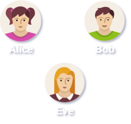

# 📖 Background Story 📖
Here you can find the chronological order of our learning process that lead us to implement the MITMv6 attack. 

The learning process is represented as a progressive story, thus it's important to follow the folders' order as shown below.

So, do you want to know why Eve is trying to run away? 😧

Or perhaps you want to know which dictator are Alice and Bob rebelling against?! 😲

Why is IPv4 sucks?! 😨

And why IPv6 sucks too?! 🤯

Jump into Alice's and Bob's world to find out all the answers by yourself.

Have fun! ☺️

# Folders Overview

### 📁Bob Story
The folder contains a problem that we encountered along our research and a solution to the problem.
* For more information, you can check out the pdf inside this folder. 

### 📁Alice Story
The folder contains a pdf describes the fundamentals behind the cache poisoning along the way to the attack, from a victim perspective. 
* For more information, you can check out the pdf inside this folder. 

### 📁Eve Story 
The folder contains a pdf which presents the attack from a attacker perspective. 

In addition, the folder has all related codes and manual instructions.
* To see more information, read the readme file in the folder.
